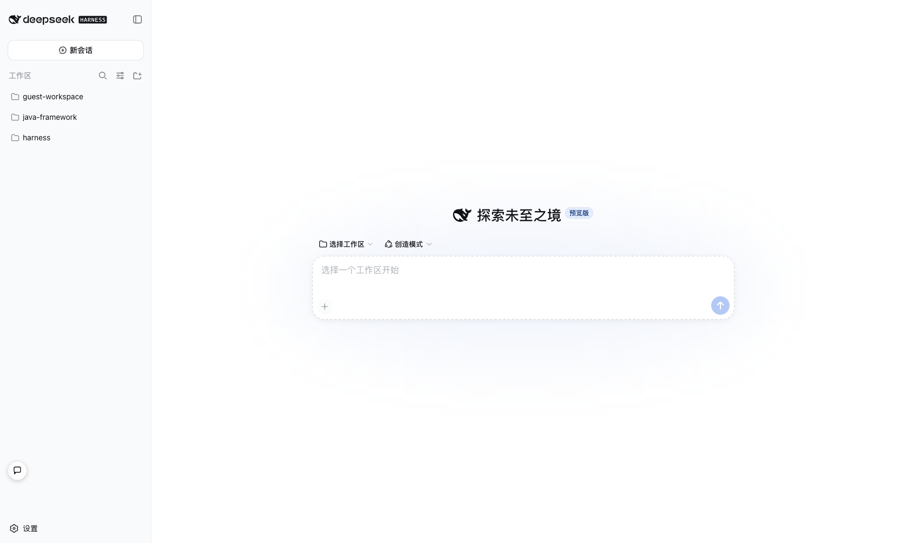
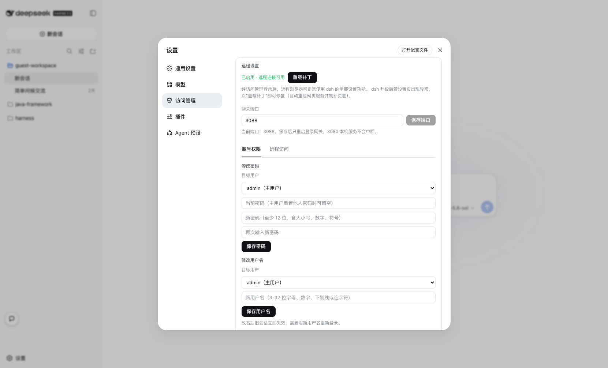
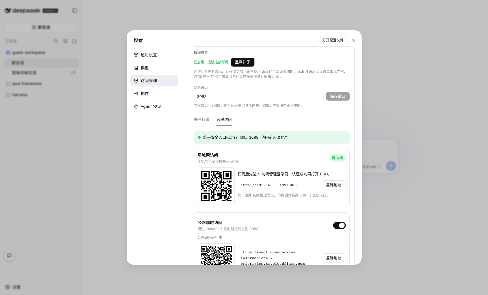
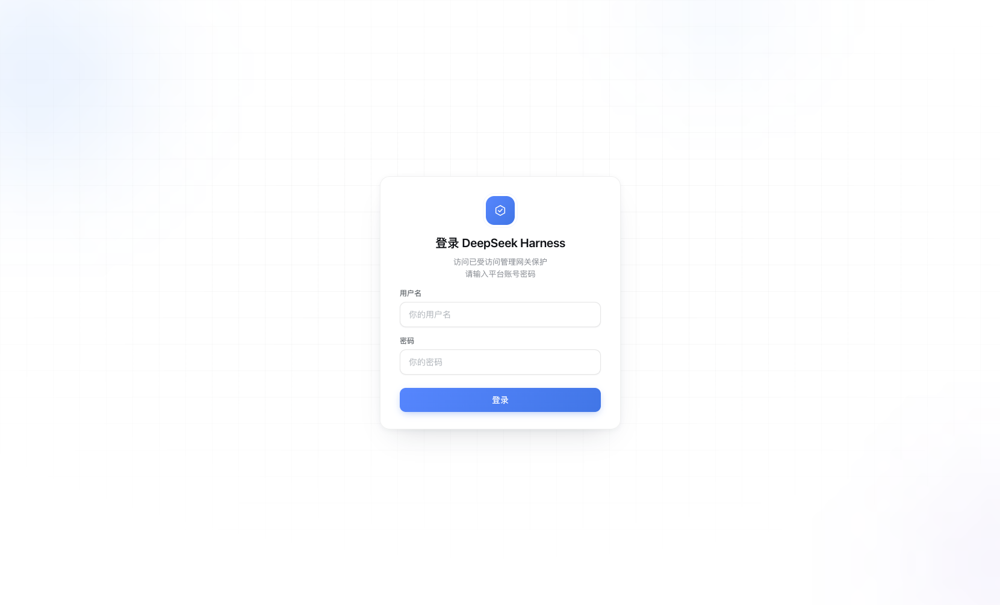
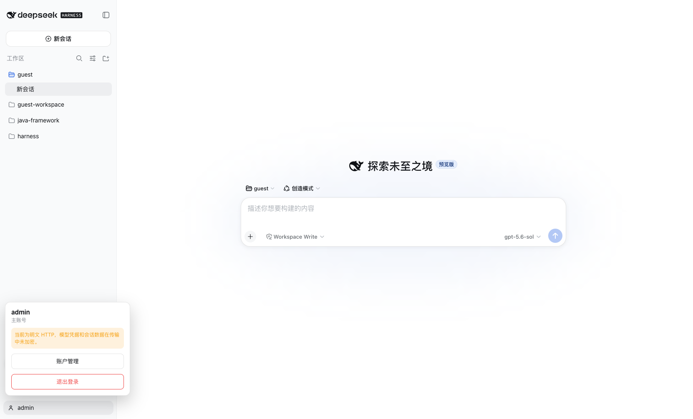
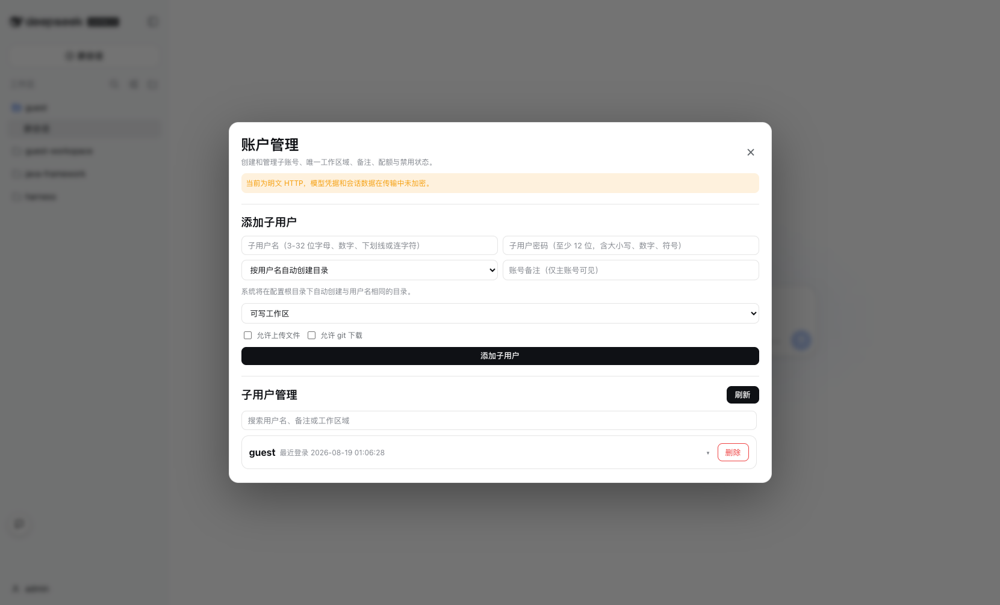
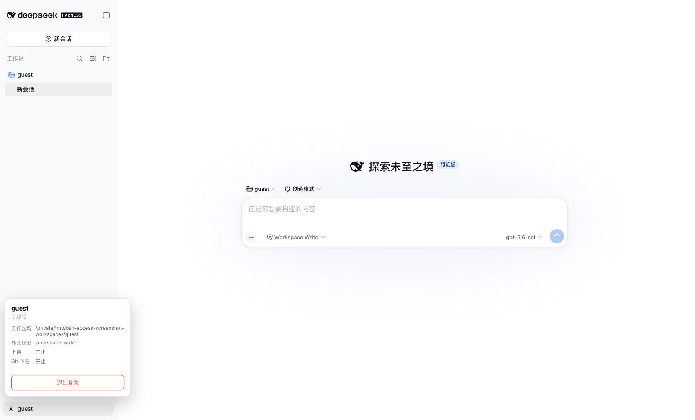
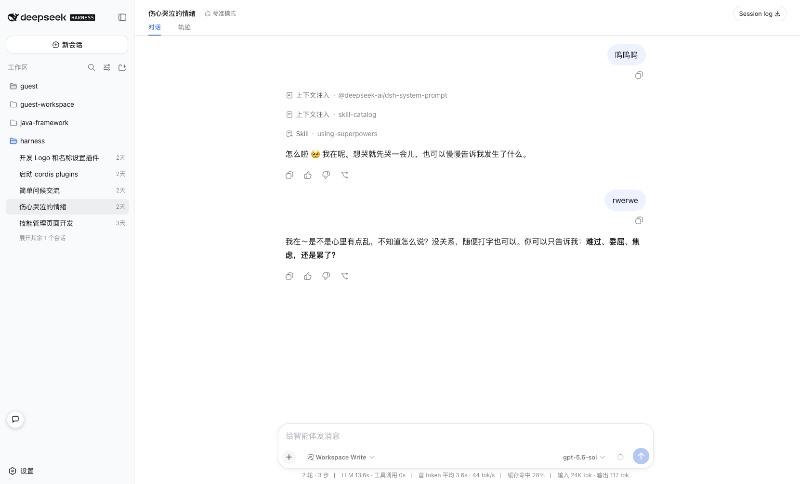
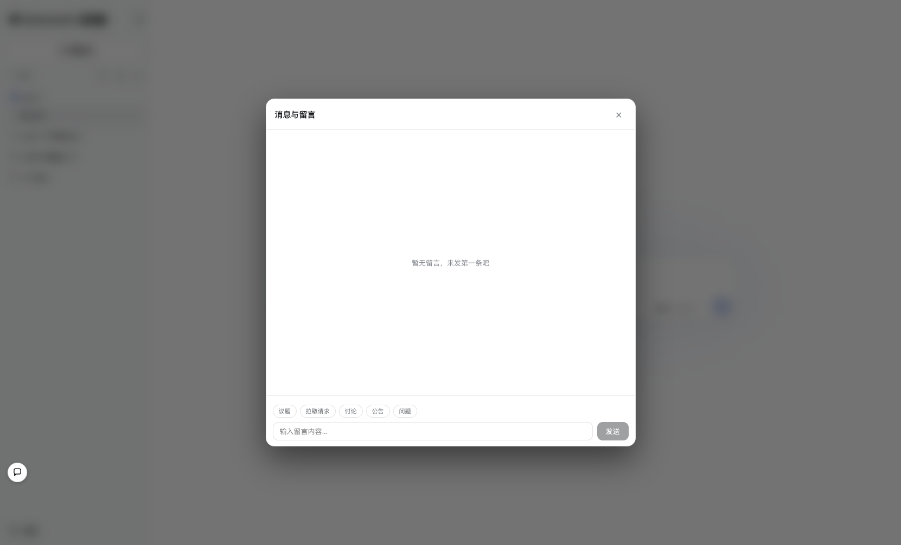

# dsh-access

**DeepSeek Harness 的访问管理网关。**

`dsh-access` 为 DeepSeek Harness（dsh）提供登录、账号权限、工作区限制、配额管理和远程访问能力。它将 dsh 的本机服务放在访问管理网关之后，让局域网或公网访问都先经过账号认证。

> 页面名称：**访问管理**  ·  当前版本：**1.0.0**

## 功能

### 访问管理

- 登录页和首次配置页
- 主用户与子用户账号
- 修改密码、修改用户名
- 账号封禁和会话撤销
- 登录记录和审计信息

### 远程访问

- 局域网登录地址和二维码
- 访问前必须通过访问管理登录
- Cloudflare 临时公网隧道
- HTTP、SSE 和 WebSocket 访问统一经过网关
- 移动端窄屏布局、侧栏抽屉和触控适配

### 权限与配额

主用户可以为子用户配置：

- 工作区根目录和目录访问范围
- 沙盒等级：只读、工作区可写、完全访问
- 每小时 token 上限
- 每日使用时长上限
- 文件上传开关
- Git 下载开关
- 账号封禁状态

### 安全边界

- dsh 上游默认保持在 `127.0.0.1:3080`
- 远程入口使用独立网关端口
- 未登录请求不能访问 dsh 页面和 API
- 删除、封禁或修改密码后，旧会话立即失效
- 子用户不能访问分配工作区之外的文件
- 不再使用独立的 Pocket 3081 入口

## 运行截图

以下截图均来自当前本地运行的 DSH Web：

### 1. DSH 主界面



### 2. 账号权限



### 3. 远程访问



访问管理从设置侧栏进入，包含“账号权限”和“远程访问”两个 Tab。

### 4. 访问管理登录页



### 5. 主账号 Admin 登录



### 6. 主账号 Admin 账户管理

点击 Admin 当前用户后进入账户管理，可创建和管理子账号。



### 7. 子账号 Guest 登录



### 8. 对话页面



### 9. 聊天框

点击左下角聊天入口后，可以查看消息与留言，并按议题、拉取请求、讨论、公告或问题分类发送内容。



## 快速开始

### 前置条件

- Node.js `22.5+`
- 已安装并能正常运行的 dsh
- Git

### Linux / macOS 安装

```bash
curl -fsSL https://raw.githubusercontent.com/xiongx9527/dsh-access/main/install.sh | bash
```

或者手动安装：

```bash
git clone https://github.com/xiongx9527/dsh-access
cd dsh-access
bash install.sh
```

### Windows 安装

下载仓库中的 `install.bat` 后双击运行，或在仓库目录执行：

```bat
install.bat
```

安装脚本会完成：

1. 安装依赖
2. 编译 dsh-access
3. 生成随机 `SETUP_KEY`
4. 创建访问管理数据库
5. 注册 dsh 插件
6. 应用远程设置补丁

### 启动

正常启动 dsh 即可：

```bash
dsh web
```

访问管理会随 dsh Web 一起启动。首次访问时打开网关地址，按照页面提示设置主用户。

## 设置页面

启动并登录 dsh 后，打开：

```text
设置 → 访问管理
```

访问管理页面包含两个 Tab：

### 账号权限

- 修改自己的密码
- 修改用户名
- 主用户管理子用户
- 配置工作区、配额、沙盒和文件权限

### 远程访问

- 查看访问管理网关状态
- 查看当前局域网访问地址
- 查看和扫描局域网二维码
- 复制局域网登录地址
- 开启或关闭 Cloudflare 临时公网访问
- 查看公网临时地址和二维码

网关端口配置位于两个 Tab 之外。保存端口后，访问管理会重启网关，并刷新远程访问地址和二维码。

## 访问地址

### 本机访问

```text
http://127.0.0.1:3080
```

3080 是 dsh 的本机上游服务。

### 局域网访问

访问管理页面会根据当前网卡生成局域网地址，格式为：

```text
http://<电脑局域网 IP>:<网关端口>
```

例如：

```text
http://192.168.1.199:3088
```

手机需要与电脑连接到同一个可互访的 Wi-Fi。若手机无法访问，请检查访客网络、AP 隔离、VPN、代理和无线客户端隔离设置。

### 公网临时访问

在“远程访问”Tab 中打开公网临时访问后，系统会启动 Cloudflare Quick Tunnel，并生成临时 HTTPS 地址。

- 临时地址每次重启可能变化
- 访问者仍然需要登录访问管理
- 隧道只转发到访问管理网关，不直接暴露 3080
- 关闭开关后，Cloudflare 进程会停止
- 已明确开启公网访问时，访问管理重启后会自动尝试恢复隧道；手动关闭后不会自动恢复
- 隧道使用 HTTP/2，适合 UDP 7844 不可用的网络环境

远程访问会对满足条件的大型 JSON/text 响应协商 Brotli 或 gzip 压缩；WebSocket、SSE、已压缩内容和 HTML 注入流程保持原有处理。手机窄屏访问 3088 时还会启用抽屉导航、安全区域和触控适配。

## 配置参考

配置文件通常位于安装目录的 `.env`，也可以通过 `DSH_ACCESS_ENV_FILE` 指定其他路径。

| 变量 | 说明 |
|---|---|
| `SETUP_KEY` | 首次配置密钥，同时参与会话密钥派生 |
| `MCP_DB_PATH` | SQLite 数据库路径 |
| `MCP_DB_ENC_KEY` | 数据静态加密密钥 |
| `MCP_GATEWAY_HOST` | 网关监听地址，默认 `0.0.0.0` |
| `MCP_GATEWAY_PORT` | 网关端口，按部署环境配置 |
| `MCP_GATEWAY_UPSTREAM` | dsh 上游地址，默认指向 loopback |
| `MCP_GATEWAY_AUTO_TLS` | 是否自动申请 HTTPS 证书 |
| `MCP_GATEWAY_DOMAIN` | 自定义 HTTPS 域名 |
| `MCP_GATEWAY_TLS_CERT` | 自定义证书路径 |
| `MCP_GATEWAY_TLS_KEY` | 自定义私钥路径 |
| `MCP_GATEWAY_PUBLIC_HOST` | 公网跳转使用的固定主机名或 IP |
| `DSH_ACCESS_CLOUDFLARED_MIRRORS` | 可选的 HTTPS 下载镜像列表，多个地址用逗号分隔；官方 GitHub 源始终优先 |
| `DSH_ACCESS_ENV_FILE` | 访问管理使用的 `.env` 文件路径 |
| `DSH_ACCESS_NO_AUTOSTART` | 设置为 `1` 时禁止插件自动启动网关，仅用于调试 |

## HTTPS 与 HTTP

公网部署建议使用自动 HTTPS 或反向代理终结 TLS。

如果只是可信内网测试，可以关闭自动 HTTPS：

```env
MCP_GATEWAY_AUTO_TLS=0
MCP_GATEWAY_PORT=3088
```

明文 HTTP 会暴露密码和会话 Cookie，不能用于不可信公网环境。

## 常用命令

```bash
# 编译
npm run build

# 运行测试
npm test

# 查看补丁状态
node dist/cli.js patch status

# 手动启动网关
node dist/cli.js serve-gateway
```

## 从旧插件迁移

`dsh-access` 不依赖旧版访问管理插件。安装新插件前，请先从 dsh Web profile 中移除旧插件，避免重复入口和端口占用。

访问管理会复用原有数据库和 `.env` 配置；不要删除数据库或 `SETUP_KEY`，否则已有账号和会话数据可能无法恢复。

## 常见问题

### 3080 可以访问，但网关端口没有启动

检查 dsh Web 是否已经启动，以及访问管理包是否已经加入当前 profile：

```bash
dsh plugin --profile web list
```

### 手机无法访问局域网地址

确认：

- 手机和电脑在同一个 Wi-Fi
- 手机不是访客网络
- 路由器没有开启 AP/客户端隔离
- Android VPN、代理和“始终开启的 VPN”已关闭
- 浏览器使用完整的 `http://` 地址

### 端口被占用

修改 `MCP_GATEWAY_PORT`，或在访问管理设置页面保存新的网关端口。保存后只重启访问管理网关，不会停止 dsh 的 3080 服务。

### 页面显示旧内容

关闭设置窗口后重新打开，或对 dsh Web 做一次硬刷新：

```text
http://127.0.0.1:3080/
```

## 开发

```bash
npm install
npm test
npm run build
```

## 许可证

本项目采用《dsh-access 非商业使用许可协议（中文）》（见 [LICENSE](./LICENSE)）。

允许个人学习、研究、评估、演示和本地非商业测试；**禁止用于任何商业活动**，包括商业生产部署、付费服务、SaaS、托管服务、商业产品集成以及任何收入或商业利益获取。需要商业使用时，请先联系版权所有者获取单独的商业许可。
