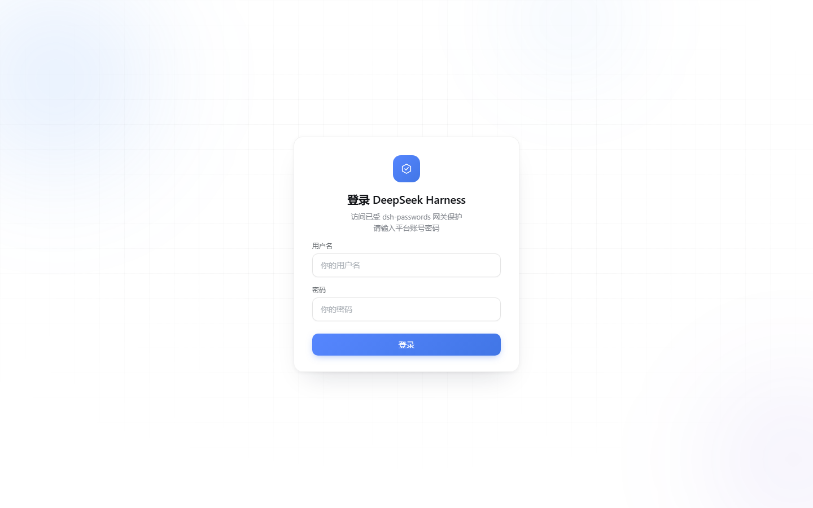
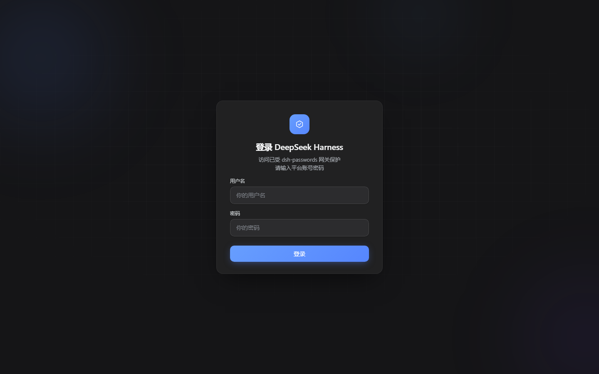
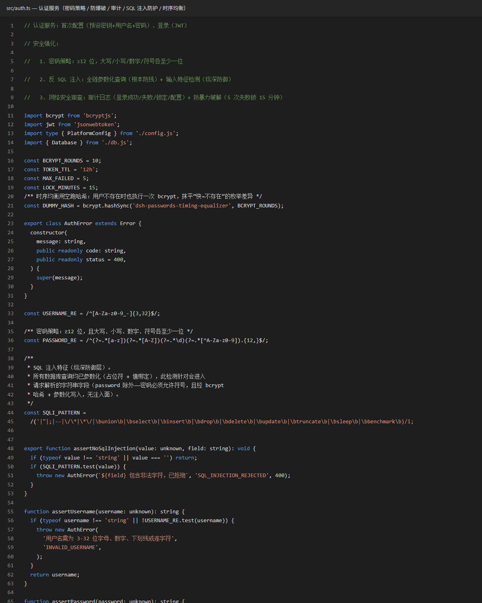
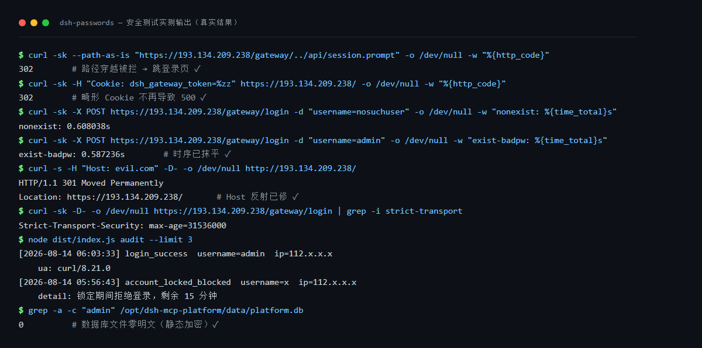

# dsh-passwords

[简体中文](README.md) | English

A **server-grade gateway** for DeepSeek Harness (dsh): it turns dsh from a local, single-user tool into a **multi-tenant platform** people can use remotely.

dsh's built-in web UI has no login, no permissions, and no usage controls — put it on a server and anyone with the URL can use it and burn your model credits. dsh-passwords puts a gateway in front of dsh: unauthenticated visitors see the login page first; after sign-in, every account is subject to **per-account permission and quota enforcement**. Installation takes a single command — **no extra configuration required**, works out of the box.

> **One-liner: dsh-passwords is the layer that turns dsh into a real server product.** Enterprise distribution, API relay/reseller stations issuing sub-accounts to customers, and teams sharing one box are its target use cases. You don't need it for purely local use; but if the access URL isn't localhost, install it first.

🏅 Listed in the [Awesome DeepSeek Harness](https://github.com/0xsline/awesome-deepseek-harness) ecosystem index (Infrastructure & Development) and the [Awesome DSH Plugin](https://github.com/awesome-dsh-plugin/awesome-dsh-plugin) list (Development & Runtime).

## Features

### 1️⃣ Remote access

- Login page + first-time setup page (on first visit you create the owner account; afterwards everyone goes through the login page)
- One login lasts 12 hours (cookie session, survives browser restarts)
- **Automatic HTTPS**: a browser-trusted Let's Encrypt certificate is issued automatically at install — zero config, auto-renewing; port 80 redirects to 443
- The login page follows dsh's theme automatically (dark when dsh is dark)
- Remote browsers can use every dsh settings feature (dsh by default only lets local browsers edit settings; dsh-passwords handles this automatically — and if the settings page breaks after a dsh upgrade, the in-settings card has a one-click "Reload patch" fix)

### 2️⃣ Multi-user

- One **owner** (created at first-time setup) + any number of **subusers**, each with their own login
- All account management happens in a card on dsh's settings page — no SSH needed: change passwords, change usernames, create/delete subusers
- The owner manages all subusers; subusers can only change themselves
- Changing a password immediately invalidates all old sessions; every login and failure is logged — one command shows who signed in when

### 3️⃣ Permissions & quotas

The owner can configure, per subuser, from the settings page:

- **Workspace allowlist**: a subuser only sees and opens the folders you assign
- **Hourly token limit** and **daily usage-time limit**: requests are rejected once the cap is hit
- **Sandbox level**: read-only / workspace-write / full access; when a subuser's AI tries to escalate beyond its level, the gateway forces the approval to "reject"
- **Upload / git-download toggles** and **ban subusers**

### 4️⃣ Collaboration

- A chat button in the bottom-left corner: owner ↔ subuser messages with tags (issue / pull request / discussion / announcement / question)

## Screenshots

| Login page (light · follows system) | Login page (dark · follows dsh theme) |
|---|---|
|  |  |

| First-time setup page (first visit) | dsh main UI (after login) |
|---|---|
|  |  |

| Auth code | Terminal tests |
|---|---|
|  |  |

## Quick start

### 0. Prerequisites (three things)

1. **Node.js 22.5+**: check with `node -v` (Linux: `curl -fsSL https://deb.nodesource.com/setup_22.x | sudo -E bash - && sudo apt-get install -y nodejs`; Windows: download from nodejs.org)
2. **dsh installed**: `npm install -g @deepseek-ai/dsh`, with your model connection working (dsh's own model config is enough; this plugin needs no extra configuration)
3. **git**: Linux: `apt-get install -y git`; Windows: download from git-scm.com (pnpm is auto-installed by the script when missing)

### 1. Install (by platform)

```bash
# Linux / macOS — Option A: download and install directly
curl -fsSL https://raw.githubusercontent.com/slywalker2006/dsh-passwords/main/install.sh | bash

# Linux / macOS — Option B: clone first, then install
git clone https://github.com/slywalker2006/dsh-passwords
cd dsh-passwords
bash install.sh
```

**Windows**: download `install.bat` from the repo and double-click it (or run it after cloning). It installs the project into `%USERPROFILE%\dsh-passwords` and completes all configuration. Binding ports 80/443 needs **no admin rights** on Windows; if a port is occupied, the gate exits with error code 32.

**npm users**:

```bash
npm install -g dsh-passwords
dsh-passwords install     # generates a random SETUP_KEY, registers the plugin and applies the patch (one-click equivalent)
```

(`dsh-passwords --version` prints the version; `dsh-passwords serve-gateway` runs the gateway manually.)

The script handles everything: install dependencies → build → **generate a random SETUP_KEY** → register as a dsh plugin → apply the remote-settings patch.

At the end the script prints your **setup key (SETUP_KEY)** on screen; it is also saved to `setup-key.txt` in the install directory. **It is deleted automatically right after the first-time setup succeeds**, and the derived keys in `.env` are frozen to independent variables and the SETUP_KEY rotated — nothing to do manually.

### 2. Finish setup in three steps

1. Start dsh the way you normally do (with dsh's model key already configured, just run `dsh web` — the gate itself needs no extra configuration) — **the password gate starts automatically, no extra commands**
2. Open `https://<server-IP>.sslip.io` in a browser — on the first visit it **automatically shows the first-time setup page**; enter the SETUP_KEY and create the owner account (no need to type `/gateway/setup` manually)
3. From now on, everyone visiting `https://<server-IP>.sslip.io` must pass the login page first

Remember to open ports **80 and 443** in both the server firewall **and** your cloud provider's security group (can't open port 80? See the deployment matrix below).

## The gate follows dsh

No systemd unit, no manual gateway process, no extra flags for dsh:

```
dsh starts → plugin loads → plugin spawns the password gate (logs appear in dsh's console)
dsh exits  → the gate stops with it (no orphan process holding ports)
```

- Advanced: to run the gateway standalone, use `node dist/cli.js serve-gateway` or set up your own systemd unit.
- Temporarily disable the auto-start (debugging): start dsh with `DSH_PASSWORDS_NO_AUTOSTART=1`.

## Automatic HTTPS (no certs to buy, nothing to configure)

- By default the server's public IP is detected and a 90-day Let's Encrypt certificate is issued for `<IP>.sslip.io`; it renews automatically 30 days before expiry (hot-loaded, no restart) — zero ongoing effort
- Own a domain? Add `MCP_GATEWAY_DOMAIN=your.domain` to `.env` and point an A record at the server; the certificate is re-issued for your domain
- **If issuance fails the gate refuses to start** (with an error code) — it never silently downgrades to plaintext HTTP. If a renewal fails while the old certificate is still valid, it keeps serving it and retries in the background.

| Error code | Meaning | What to do |
|---|---|---|
| **30** | Certificate issuance failed | Check 80/443 are open (firewall + cloud security group), 80 isn't occupied, and Let's Encrypt is reachable |
| **31** | No public IP/domain detected | The server has no public IP or detection failed. Set `MCP_GATEWAY_DOMAIN` if you have a domain; use HTTP mode for LAN-only setups |
| **32** | Port already in use | Change `MCP_GATEWAY_PORT` in `.env` or free the port |

> Why the `.sslip.io` in the URL? Browsers require the certificate name to match the URL, and Let's Encrypt does not issue certificates for bare IPs — `<IP>.sslip.io` is a free name-borrowing service. Opening the bare IP over `https://` directly will still warn about a hostname mismatch; that's expected. Entering via port 80 redirects to the correct address automatically.

## Deployment matrix (all about port 80)

Automatic HTTPS uses Let's Encrypt's http-01 validation, which requires **LE to connect directly to port 80 of your server's public IP** — the security group, the OS firewall and any NAT forwarding must all allow it. Can't open port 80? Pick your scenario:

| Scenario | What to do | What users see | Ports to open |
|---|---|---|---|
| ✅ Public server, can open 80/443 | Nothing — the default | HTTPS (auto certificate) | 80 + 443 |
| ✅ You already have a domain certificate | Set `MCP_GATEWAY_TLS_CERT/KEY` in `.env` (any port) | HTTPS (your certificate) | Only your gateway port — 80 not needed at all |
| ✅ nginx/caddy reverse proxy already on the machine | The proxy terminates TLS on 80/443 with a real certificate and forwards to the gate; set `MCP_GATEWAY_AUTO_TLS=0` + a high port in `.env`, gate listens on loopback only | HTTPS (the proxy's certificate) | The proxy owns 80/443; the gate has zero public exposure |
| ✅ Domain on Cloudflare | Cloudflare terminates TLS at the edge and forwards to any origin port (same `.env` settings as the reverse-proxy case) | HTTPS (Cloudflare's certificate) | Origin open to Cloudflare only |
| ⚠ No public IP / LAN only | `scripts/start-http.mjs` or `AUTO_TLS=0` in `.env` | Plain HTTP | Any port |
| ⚠ Bare IP only, port 80 blocked | HTTP is the only option (protocol limit: http-01 always uses port 80, and a bare IP has no DNS to validate) | Plain HTTP | Any port |

> Note: http-01 only touches port 80 during issuance and renewal (a few seconds, roughly every 60 days). `MCP_GATEWAY_REDIRECT_PORT` defaults to 80 — it handles both the challenge answers and the 301 redirect.

## HTTP mode (plaintext — avoid when possible)

The gate **refuses** to run in plaintext HTTP by default. If you really must (LAN-only, and you accept the risk):

```bash
node scripts/start-http.mjs [port]    # default 8080, asks for y/N confirmation
```

The script prints a plaintext-risk warning first and only starts after you type `y`. Over plain HTTP, passwords and session cookies can be sniffed on the network — for public deployments prefer automatic HTTPS (the default mode; use HTTP mode only when a certificate truly cannot be issued).

For a permanent setup: put `MCP_GATEWAY_AUTO_TLS=0` and `MCP_GATEWAY_PORT=8080` in `.env`; the plugin will then start the gate in HTTP mode whenever dsh starts.

## The gate card in dsh settings

After logging in to dsh, open **Settings → Plugins** to find the "dsh-passwords · Password gate" card:

| Feature | Who can use it | Notes |
|---|---|---|
| **Remote settings + reload patch** | All signed-in users | Remote settings are applied (always on); after a dsh upgrade, click "Reload patch" to fix the settings page in one click (restarts the web service and refreshes the page — no SSH) |
| **Change password** | Yourself; the owner can change anyone's | Old sessions are invalidated immediately |
| **Change username** | Yourself; the owner can change anyone's | Sign in with the new username afterwards |
| **Subuser management** | Owner only | Create/delete subusers (subusers can sign in but have no admin rights) |
| **Subuser permissions** | Owner only | Workspace allowlist, hourly token limit, daily time limit, sandbox level, upload/git-download toggles, ban |
| **Remote access** | Owner configures it | LAN QR code, login URL and Cloudflare quick tunnel; all traffic enters through the Passwords login gateway |
| **Chat / messages** | All signed-in users | Chat button in the bottom-left corner, with tags (issue/pull request/discussion/announcement/question) |

- **Owner** = the account created at first-time setup; everything added later is a **subuser**.
- Passwords follow the same rule as the login page: at least 12 characters with uppercase, lowercase, digits and symbols.

### Unified remote access

The expanded card has two tabs: **Accounts & permissions** and **Remote access**. The gateway port is shared configuration. After a new port is saved and the gateway is confirmed running, the card switches to Remote access and refreshes the LAN URL and QR code.

- LAN URLs use `http://<computer-LAN-IP>:<gateway-port>` and always open the Passwords sign-in flow first.
- A Cloudflare quick tunnel targets the same Passwords gateway and still requires an account login.
- Port 3080 remains the loopback-only upstream; this plugin does not listen on Pocket's port 3081.
- If `dsh-pocket` is already installed, disable or remove it to avoid duplicate entry points and port conflicts. This plugin never uninstalls another plugin automatically.
- Plain HTTP is suitable only for a trusted LAN; prefer HTTPS for public access.

## Configuration reference (.env)

| Variable | Default | Purpose |
|---|---|---|
| `SETUP_KEY` | auto-generated by the installer | First-time setup key; the JWT session key is derived from it — **keep it after install** |
| `MCP_JWT_SECRET` | empty (derived from SETUP_KEY) | Session signing key. For production, set it independently (`openssl rand -hex 32`) so a leaked SETUP_KEY can't forge sessions |
| `MCP_DB_PATH` | `./data/platform.db` | Database file (SQLite, created automatically — no MySQL needed) |
| `MCP_DB_ENC_KEY` | empty | Data-at-rest encryption key. Generate with `openssl rand -hex 32`. **Once set it must never change**, or old data becomes unreadable |
| `MCP_GATEWAY_HOST` | `0.0.0.0` | Gateway listen address |
| `MCP_GATEWAY_PORT` | `443` | Gateway port |
| `MCP_GATEWAY_UPSTREAM` | `http://127.0.0.1:3080` | dsh web address (the plugin points it at dsh's actual port automatically — usually leave as-is) |
| `MCP_GATEWAY_REDIRECT_PORT` | `80` | Port 80: ACME challenge answers + 301 redirect to 443 |
| `MCP_GATEWAY_DOMAIN` | empty | Your own domain; when empty, `<public-IP>.sslip.io` is used |
| `MCP_GATEWAY_AUTO_TLS` | on | Empty = auto; `0` disables it (plaintext HTTP, dangerous) |
| `MCP_GATEWAY_ACME_EMAIL` | empty | Optional email for expiry notifications |
| `MCP_GATEWAY_ACME_STAGING` | off | `1` = issue from the LE staging environment (for testing; browsers won't trust it) |
| `MCP_GATEWAY_TLS_CERT` / `MCP_GATEWAY_TLS_KEY` | empty | When both are set, your own certificate is used (takes priority over auto HTTPS) |
| `MCP_GATEWAY_PUBLIC_HOST` | empty | Public IP/domain used for redirects (prevents Host-header reflection) |
| `MCP_DSH_ROOT` | auto-detected | dsh install directory (where `@deepseek-ai/dsh` lives); set manually if detection fails |
| `MCP_DSH_RESTART_SERVICE` | `dsh-web` | systemd service to restart after a patch reload; an explicit empty value disables auto-restart |
| `DSH_PASSWORDS_ENV_FILE` | empty | Explicit path to `.env` (the plugin passes it automatically — usually not needed) |

## Common commands

```bash
node dist/cli.js audit --limit 20             # last 20 audit-log entries (auto-decrypted)
node dist/cli.js patch status                 # remote-settings patch status
node dist/cli.js patch                        # reload the patch (re-applies + restarts dsh-web)
node dist/cli.js serve-gateway --port 9000    # run the gateway manually on another port
node scripts/start-http.mjs 8080              # plaintext HTTP mode (dangerous, y/N confirmation)
```

## FAQ

- **The login page keeps showing "First-time setup"?** The user table is empty (fresh or wiped database). Enter the `SETUP_KEY` as prompted to create the owner account again.
- **Forgot the owner password?** Stop the service and run `node -e "const {DatabaseSync}=require('node:sqlite');const db=new DatabaseSync('data/platform.db');db.exec('DELETE FROM users;')"`, then restart and redo first-time setup.
- **dsh's console shows error code 30 / 31 and the gate didn't start?** See the error-code table under "Automatic HTTPS" above. After fixing, restarting dsh pulls the gate up again.
- **Port 443 fails to bind (non-root user)?** On Linux, ports below 1024 need root: start dsh as root/sudo, or set `MCP_GATEWAY_PORT` to a high port (e.g. 8443) and forward traffic yourself.
- **dsh fails to start with `duplicate loader entry id`?** You used `dsh plugin add` in the profile. It reconciles ALL dependencies declaring `dsh.bundle` into the bundles layer, which crashes dsh when they overlap with already-installed plugins. Uninstall dsh-passwords and register precisely with `node scripts/register-plugin.mjs` (it appends only this plugin).
- **npm fails installing dsh (allow-scripts / node-pty)?** Newer npm blocks install scripts. Allow them first, then reinstall: `npm config set allow-scripts=@deepseek-ai/dsh-subprocess-local,koffi,node-pty,@google/genai,protobufjs --location=user` followed by `npm install -g @deepseek-ai/dsh` again (this project itself has no such issue — it's dsh's dependencies that run native builds).
- **dsh reports `crypto.randomUUID is not a function`?** An older gateway build lacks the HTML injection compat layer — update the code and **hard-refresh the browser** (Ctrl+Shift+R).
- **Is it a problem if the database file is stolen?** No. Sensitive fields are encrypted or hashed; without the keys in `.env` they can't be read, and passwords only exist as bcrypt hashes anyway.
- **Can I change `MCP_DB_ENC_KEY` later?** No. Once enabled it must never change, or all historical data becomes unreadable. Back up `.env` together with the database.
- **Stuck on "Loading plugins…" every time?** dsh loads ~30 plugin scripts and answers `no-cache` for them, so the browser re-downloads everything each visit. The gateway forces one-year immutable caching for `/assets/*` and rev-hashed `/plugins/*` (URLs change whenever dsh updates). After an upgrade the first visit still downloads everything once, then refreshes are instant; if it's still slow, hard-refresh once so the new headers apply.
- **Access feels slow?** The gate itself adds only ~1-2ms per request. Check the TLS handshake first: `curl -s -o /dev/null -w "TCP:%{time_connect}s TLS:%{time_appconnect}s\n" https://your-host/gateway/login` — TLS should be tens of milliseconds. If both TCP and TLS are fast, the latency is your network path to the server, which no code can fix.

## Manual install (step by step)

> Windows users: use `install.bat` instead. This section uses Linux as the example; the steps are equivalent.

1. `git clone https://github.com/slywalker2006/dsh-passwords && cd dsh-passwords`
2. `npm install && npm run build`
3. `cp .env.example .env`, replace `SETUP_KEY` with a random string (`openssl rand -hex 24`)
4. Register the plugin: `node scripts/register-plugin.mjs` (equivalent to adding `link:$(pwd)` to the dependencies and `dsh.profile.bundles` of `~/.dsh/profiles/web/package.json`, then `pnpm install`. **Don't use `dsh plugin add`** — see the FAQ)
5. Apply the patch: `node dist/cli.js patch` (if the dsh directory isn't found, set `MCP_DSH_ROOT=/path/to/@deepseek-ai/dsh`)

Then as usual: start dsh → the gate starts automatically → open `https://<your-host>` to finish first-time setup.

## Security & privacy

Passwords are stored only as bcrypt hashes; usernames, IPs and audit records are encrypted at rest; every login and failure is audited; certificate-issuance failure stops the service instead of downgrading to plaintext. All keys live in your own `.env` and database — open source code does not weaken security.

- **Brute-force protection**: failed logins lock the account, and the lock duration backs off per round (1 → 5 → 15 → 60 minutes, capped). Owner accounts can't be globally locked out by IP-rotation (per-IP locking still applies) — prevents account-level DoS.
- **Password-spray protection (per-IP throttle)**: 30 failed logins from the same IP within 15 minutes → that IP is globally throttled for 30 minutes (accumulated across usernames — aimed at the "one IP rotating many usernames" spraying technique; bcrypt is not consumed while throttled, and a successful login lifts the throttle). If a large NAT/shared egress trips it by accident, it auto-recovers after 30 minutes with no manual action.
- **Session revocation**: logging out revokes the token server-side immediately; changing the password/username invalidates all old sessions.
- **Subuser isolation (third-party plugin surface)**: ops endpoints such as dsh-ssh (SSH hosts/tunnels), skin-center, modlens, and the dsh-uploads list/delete are owner-only; upload/download stay gated by `allow_upload` / `allowGitDownload`, and **new subusers default to git download off** (including dsh-uploads download and other exfiltration channels) — the owner enables it per-user, so subusers can't enumerate or exfiltrate files from the shared upload storage.
- **Slow-connection protection**: explicit request timeouts (half-open headers cut off at 20s) plus a concurrent-connection cap (512 gateway / 256 redirect) to resist slowloris-style resource exhaustion.
- **Path normalization**: the gate resolves the prefix from the raw URL with iterative decoding (blocks double-encoding), slash collapsing and WHATWG normalization — `%2f..%2f` / `%252f..` SPA-shell bypass variants are all rejected.
- **Hardening tips**:
  1. **After the first-time setup the system automatically deletes `setup-key.txt`, freezes the JWT/internal/field-encryption keys into independent `.env` variables, and rotates SETUP_KEY** — no manual steps needed; only if you deploy against an already-initialized instance (never visiting the setup page) should you delete `setup-key.txt` manually;
  2. For stronger isolation you can set an **independent `MCP_JWT_SECRET`** and `MCP_DB_ENC_KEY` in `.env` (both via `openssl rand -hex 32`) — after first-time setup these are already frozen automatically; setting them manually just swaps in new keys;
  3. Point `MCP_DSH_RESTART_SERVICE` at the correct systemd service name.

## Language

The UI is bilingual (Chinese/English) and follows dsh's language setting:

- **Login / setup pages**: follow dsh's language (Settings → General → Language), then the browser language; a 中文/English toggle at the top-right persists your choice.
- **Settings card**: follows dsh's language setting, switches instantly.
- **CLI**: follows the `LANG` / `LC_ALL` environment variables (`en` prefix = English).

## License

[BSD 3-Clause](./LICENSE) © 2026 slywalker2006 — free to use, modify and distribute; keep the copyright notice.

This project is an independent extension for dsh and is not affiliated with DeepSeek. dsh itself is licensed under its own terms (MIT).
